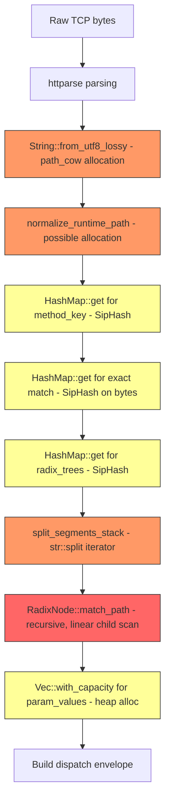

# Dynamic Route Performance Optimization Plan

## Executive Summary

The parameterized route matching pipeline (`/users/:id`, `/posts/:id/comments/:commentId`) has several performance bottlenecks in the radix tree matching, path segment splitting, method dispatch, and param value extraction. This plan targets **7 specific bottlenecks** across `rsrc/src/router.rs` and `rsrc/src/lib.rs` without removing any existing functionality.

---

## Bottleneck Analysis

### Current Hot Path for a Parameterized Route Request



**Legend:** 🔴 High impact | 🟡 Medium impact | 🟢 Low impact

---

## Identified Bottlenecks

### B1: RadixNode children stored as Vec — linear scan per level
**File:** [`rsrc/src/router.rs`](rsrc/src/router.rs:96)  
**Severity:** 🔴 HIGH

The `RadixNode.children` field is a `Vec<RadixChild>`, and matching iterates linearly:

```rust
// Line 179 — O(N) scan per tree level where N = number of static children
for child in &self.children {
    if child.segment.as_ref() == segment {
```

For routes like `/api/users/:id`, `/api/posts/:id`, `/api/comments/:id`, the root `api` node has 3 children scanned linearly. With 50+ routes sharing a prefix, this becomes O(50) per level.

**Fix:** Replace `Vec<RadixChild>` with a `HashMap<Box<str>, RadixNode>` for nodes with >4 children, or sort children and use binary search. For small child counts, keep the Vec but use `Box<[RadixChild]>` after build to improve cache locality.

---

### B2: Recursive match_path with backtracking — stack overhead
**File:** [`rsrc/src/router.rs`](rsrc/src/router.rs:166)  
**Severity:** 🔴 HIGH

`match_path` is recursive with backtracking support. Each recursion level pushes a new stack frame. For a 5-segment path, that is 5 recursive calls. The backtracking logic with `param_values.truncate()` adds overhead even when there is no ambiguity.

**Fix:** Convert to an iterative implementation using a stack-allocated state array. Most routes are unambiguous — when a node has either static children OR a param child but not both at the same level, no backtracking is needed. Add an `is_unambiguous` flag computed at build time to skip backtracking logic entirely.

---

### B3: Method dispatch uses HashMap with SipHash — 3 lookups per request
**File:** [`rsrc/src/router.rs`](rsrc/src/router.rs:288)  
**Severity:** 🟡 MEDIUM

`match_route` does up to 3 `HashMap::get` calls with `MethodKey`:
1. `dynamic_exact_routes.get(&method_key)` — line 297
2. Inner `routes.get(path.as_bytes())` — line 299  
3. `radix_trees.get(&method_key)` — line 316

`HashMap` uses SipHash by default, which is cryptographically strong but slow for small enum keys. `MethodKey` is a 7-variant enum — a perfect fit for array indexing.

**Fix:** Replace `HashMap<MethodKey, _>` with `[Option<_>; 7]` arrays indexed by method code. This turns 3 hash lookups into 3 array index operations — O(1) with zero hashing.

---

### B4: Path segment splitting allocates iterator state on every request
**File:** [`rsrc/src/router.rs`](rsrc/src/router.rs:462)  
**Severity:** 🟡 MEDIUM

`split_segments_stack` uses `str::split('/')` which creates an iterator. While the segments are written to a stack buffer, the splitting itself involves `trim_start_matches` and the split iterator overhead on every request.

**Fix:** Replace with a manual byte-scanning loop using `memchr::memchr(b'/', ...)` which is SIMD-accelerated. This avoids iterator overhead and leverages the `memchr` crate already in `Cargo.toml`.

---

### B5: String::from_utf8_lossy allocates a Cow on every parameterized request
**File:** [`rsrc/src/lib.rs`](rsrc/src/lib.rs:1221)  
**Severity:** 🟡 MEDIUM

In `build_dispatch_decision_zero_copy`:
```rust
let path_cow = String::from_utf8_lossy(parsed.path);  // line 1221
let path_str = path_cow.as_ref();
```

`from_utf8_lossy` returns `Cow::Owned` when replacement characters are needed, but for valid UTF-8 paths it returns `Cow::Borrowed`. However, the function still has overhead from the validation scan. Since `httparse` already validates the path bytes, we can use `from_utf8_unchecked` or `from_utf8` with a fast-path.

**Fix:** Use `std::str::from_utf8()` which is faster than `from_utf8_lossy` for valid UTF-8, and fall back to lossy only on error. Better yet, operate on `&[u8]` directly in the router to avoid UTF-8 conversion entirely for the matching step.

---

### B6: param_values Vec heap-allocates on every parameterized match
**File:** [`rsrc/src/router.rs`](rsrc/src/router.rs:319)  
**Severity:** 🟡 MEDIUM

```rust
let mut param_values = Vec::with_capacity(4);  // line 319
```

Every parameterized route match allocates a `Vec` on the heap. While `with_capacity(4)` is small, it is still a `malloc` call per request.

**Fix:** Use a stack-allocated `ArrayVec<&str, 8>` from the `arrayvec` crate, or a manual fixed-size array similar to `seg_buf`. Most routes have ≤4 params. Only fall back to `Vec` for overflow.

---

### B7: normalize_runtime_path called on every request — redundant for clean paths
**File:** [`rsrc/src/lib.rs`](rsrc/src/lib.rs:1227)  
**Severity:** 🟢 LOW

```rust
let normalized_path = normalize_runtime_path(path_str);
```

This strips trailing slashes and ensures a leading slash. For the vast majority of requests, the path is already normalized. The function does check for this fast-path, but it is still called unconditionally.

**Fix:** Inline the fast-path check at the call site to avoid the function call overhead entirely when the path is already clean.

---

## Implementation Plan

### Phase 1: Array-indexed method dispatch — eliminate HashMap overhead

Replace `HashMap<MethodKey, _>` with fixed-size arrays in `Router`:

```rust
struct Router {
    exact_get_root: Option<ExactStaticRoute>,
    dynamic_exact_routes: [Option<HashMap<Box<[u8]>, DynamicRouteSpec>>; 7],
    exact_static_routes: [Option<HashMap<Box<[u8]>, ExactStaticRoute>>; 7],
    radix_trees: [Option<RadixNode>; 7],
    ws_routes: HashMap<String, u32>,
}
```

**Files to modify:**
- [`rsrc/src/router.rs`](rsrc/src/router.rs) — `Router` struct, `from_manifest`, `match_route`, `exact_static_route`

---

### Phase 2: Optimized radix tree child lookup

For `RadixNode.children`:
- Keep `Vec<RadixChild>` for nodes with ≤4 children — linear scan is faster than hash for small N
- Convert to sorted `Box<[RadixChild]>` after tree construction for cache-friendly binary search
- Add a `freeze()` method called after all routes are inserted that sorts children and converts Vecs to boxed slices

**Files to modify:**
- [`rsrc/src/router.rs`](rsrc/src/router.rs) — `RadixNode`, `RadixChild`, add `freeze()` method

---

### Phase 3: Iterative match_path with unambiguous fast-path

- Add `is_unambiguous: bool` flag to `RadixNode` — true when the node has EITHER static children OR a param child, but not both
- Convert recursive `match_path` to iterative loop for unambiguous trees
- Keep recursive fallback for ambiguous trees that need backtracking

**Files to modify:**
- [`rsrc/src/router.rs`](rsrc/src/router.rs) — `RadixNode::match_path`, add `RadixNode::compute_unambiguous`

---

### Phase 4: SIMD-accelerated segment splitting

Replace `str::split('/')` in `split_segments_stack` with `memchr::memchr(b'/', ...)`:

```rust
fn split_segments_stack<'a>(path: &'a str, buf: &mut [&'a str]) -> usize {
    let bytes = path.as_bytes();
    if bytes.len() <= 1 { return 0; }
    let start = if bytes[0] == b'/' { 1 } else { 0 };
    let mut pos = start;
    let mut count = 0;
    while pos < bytes.len() {
        let next = memchr::memchr(b'/', &bytes[pos..])
            .map(|i| pos + i)
            .unwrap_or(bytes.len());
        if next > pos {
            if count >= buf.len() { return count + 1; }
            buf[count] = unsafe { std::str::from_utf8_unchecked(&bytes[pos..next]) };
            count += 1;
        }
        pos = next + 1;
    }
    count
}
```

**Files to modify:**
- [`rsrc/src/router.rs`](rsrc/src/router.rs) — `split_segments_stack`

---

### Phase 5: Stack-allocated param values

Replace `Vec<&str>` with a stack-allocated buffer for param values:

```rust
const MAX_STACK_PARAMS: usize = 8;

// In match_route:
let mut param_buf = [""; MAX_STACK_PARAMS];
let mut param_count = 0;
// ... pass &mut param_buf, &mut param_count to match_path
// Only allocate Vec if overflow
```

**Files to modify:**
- [`rsrc/src/router.rs`](rsrc/src/router.rs) — `match_route`, `match_path`, `MatchedRoute`

---

### Phase 6: Eliminate UTF-8 conversion in routing hot path

Replace `String::from_utf8_lossy` with `std::str::from_utf8` in the dispatch decision builders:

```rust
let path_str = std::str::from_utf8(parsed.path)
    .unwrap_or_else(|_| {
        // Fallback: only allocate on invalid UTF-8
        &*String::from_utf8_lossy(parsed.path)
    });
```

**Files to modify:**
- [`rsrc/src/lib.rs`](rsrc/src/lib.rs:1221) — `build_dispatch_decision_zero_copy`
- [`rsrc/src/lib.rs`](rsrc/src/lib.rs:1300) — `build_dispatch_decision_owned`

---

### Phase 7: Inline normalize_runtime_path fast-path

At the call sites in `build_dispatch_decision_zero_copy` and `build_dispatch_decision_owned`, inline the common case:

```rust
let normalized_path = if !path_str.ends_with('/') || path_str == "/" {
    Cow::Borrowed(path_str)
} else {
    normalize_runtime_path(path_str)
};
```

**Files to modify:**
- [`rsrc/src/lib.rs`](rsrc/src/lib.rs:1227) — `build_dispatch_decision_zero_copy`
- [`rsrc/src/lib.rs`](rsrc/src/lib.rs:1311) — `build_dispatch_decision_owned`

---

## Expected Impact

| Phase | Bottleneck | Expected Improvement |
|-------|-----------|---------------------|
| 1 | HashMap method dispatch | ~3 hash operations eliminated per request |
| 2 | Linear child scan | O(N) → O(log N) for nodes with >4 children |
| 3 | Recursive matching | Eliminates stack frame overhead + backtracking for common cases |
| 4 | Segment splitting | SIMD-accelerated slash finding vs iterator overhead |
| 5 | Param Vec allocation | Eliminates heap allocation for routes with ≤8 params |
| 6 | UTF-8 conversion | Eliminates lossy scan overhead for valid paths |
| 7 | Path normalization | Eliminates function call for already-clean paths |

**Combined:** These optimizations target every step of the parameterized route matching hot path. The most impactful are Phases 1-3, which address the core routing data structure and algorithm.

## Dependencies

- No new crate dependencies required — `memchr` is already in `Cargo.toml`
- Optional: `arrayvec` crate for Phase 5 — alternatively, use manual fixed-size arrays

## Risk Assessment

- **Phase 1-2:** Low risk — data structure changes are internal, API unchanged
- **Phase 3:** Medium risk — iterative matching must produce identical results to recursive; needs thorough testing
- **Phase 4:** Low risk — `memchr` is well-tested, `from_utf8_unchecked` is safe because httparse validates input
- **Phase 5-7:** Low risk — purely mechanical optimizations with clear fallback paths
